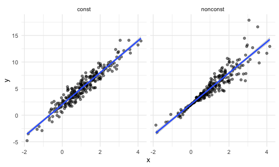
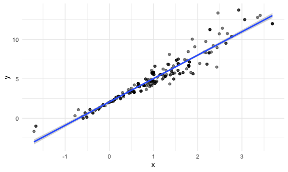

Bootstrapping
================

## Simulate data

``` r
n_samp = 250

sim_df_const = 
  tibble(
    x = rnorm(n_samp, 1, 1),
    error = rnorm(n_samp, 0, 1),
    y = 2 + 3 * x + error
  )

sim_df_nonconst = sim_df_const %>% 
  mutate(
  error = error * .75 * x,
  y = 2 + 3 * x + error
)
```

Plot the datasets

``` r
sim_df = 
  bind_rows(const = sim_df_const, nonconst = sim_df_nonconst, .id = "data_source") 

sim_df %>% 
  ggplot(aes(x = x, y = y)) + 
  geom_point(alpha = .5) +
  stat_smooth(method = "lm") +
  facet_grid(~data_source) 
```

    ## `geom_smooth()` using formula 'y ~ x'



``` r
lm(y ~ x, data = sim_df_const) %>% 
  broom::tidy() %>% 
  knitr::kable(digits = 3)
```

| term        | estimate | std.error | statistic | p.value |
| :---------- | -------: | --------: | --------: | ------: |
| (Intercept) |    2.016 |     0.090 |    22.424 |       0 |
| x           |    2.998 |     0.061 |    49.152 |       0 |

``` r
lm(y ~ x, data = sim_df_nonconst) %>% 
  broom::tidy() %>% 
  knitr::kable(digits = 3) ## lm gives results given assumptions are true, 但sim_df_nonconst并不是normal distribution， 所以即便是standard error很小，结果也是不准确的，解决这个问题的办法就是用bootstrap
```

| term        | estimate | std.error | statistic | p.value |
| :---------- | -------: | --------: | --------: | ------: |
| (Intercept) |    2.089 |     0.103 |    20.372 |       0 |
| x           |    2.926 |     0.070 |    42.063 |       0 |

## draw one bootstrap sample

one bootstrap 相当于取跟raw data相同sample size的samples，
但是每次只取一个，每次都放回，所以有些sample会被反复取
create bootstrap function

``` r
boot_sample = function(df) {
  sample_frac(df, replace = TRUE)
} 

# replace = TRUE,makes sample size fixed, 每次取必放回
```

check if this works…

``` r
boot_sample(sim_df_nonconst) %>% 
  ggplot(aes(x = x, y = y)) + 
  geom_point(alpha = .5) +
  stat_smooth(method = "lm")
```

    ## `geom_smooth()` using formula 'y ~ x'


