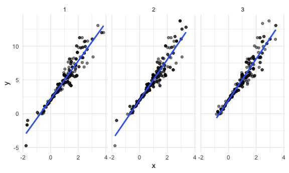
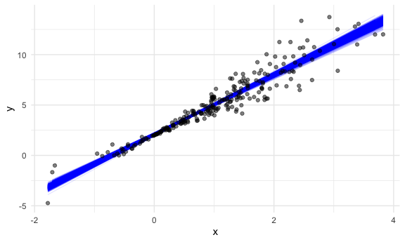

Bootstrapping
================

## Simulate data

``` r
n_samp = 250

sim_df_const = 
  tibble(
    x = rnorm(n_samp, 1, 1),
    error = rnorm(n_samp, 0, 1),
    y = 2 + 3 * x + error
  )

sim_df_nonconst = sim_df_const %>% 
  mutate(
  error = error * .75 * x,
  y = 2 + 3 * x + error
)
```

Plot the datasets

``` r
sim_df = 
  bind_rows(const = sim_df_const, nonconst = sim_df_nonconst, .id = "data_source") 

sim_df %>% 
  ggplot(aes(x = x, y = y)) + 
  geom_point(alpha = .5) +
  stat_smooth(method = "lm") +
  facet_grid(~data_source) 
```

    ## `geom_smooth()` using formula 'y ~ x'


``` r
lm(y ~ x, data = sim_df_const) %>% 
  broom::tidy() %>% 
  knitr::kable(digits = 3)
```

| term        | estimate | std.error | statistic | p.value |
| :---------- | -------: | --------: | --------: | ------: |
| (Intercept) |    1.917 |     0.084 |    22.877 |       0 |
| x           |    3.067 |     0.060 |    51.385 |       0 |

``` r
lm(y ~ x, data = sim_df_nonconst) %>% 
  broom::tidy() %>% 
  knitr::kable(digits = 3) ## lm gives results given assumptions are true, 但sim_df_nonconst并不是normal distribution， 所以即便是standard error很小，结果也是不准确的，解决这个问题的办法就是用bootstrap
```

| term        | estimate | std.error | statistic | p.value |
| :---------- | -------: | --------: | --------: | ------: |
| (Intercept) |    2.098 |     0.084 |    25.057 |       0 |
| x           |    2.939 |     0.060 |    49.292 |       0 |

## draw one bootstrap sample

one bootstrap 相当于取跟raw data相同sample size的samples，
但是每次只取一个，每次都放回，所以有些sample会被反复取
create bootstrap function

``` r
boot_sample = function(df) {
  sample_frac(df, replace = TRUE)
} 

# replace = TRUE,makes sample size fixed, 每次取必放回
```

check if this works…

``` r
boot_sample(sim_df_nonconst) %>% 
  ggplot(aes(x = x, y = y)) + 
  geom_point(alpha = .5) +
  stat_smooth(method = "lm")
```

    ## `geom_smooth()` using formula 'y ~ x'


## Many samples and analysis

``` r
boot_straps = 
  data_frame(
    strap_number = 1:1000,
    strap_sample = rerun(1000, boot_sample(sim_df_nonconst))
  )
```

    ## Warning: `data_frame()` is deprecated as of tibble 1.1.0.
    ## Please use `tibble()` instead.
    ## This warning is displayed once every 8 hours.
    ## Call `lifecycle::last_warnings()` to see where this warning was generated.

``` r
boot_straps ###相当于做1000次bootstrap，每次都取跟raw data samples size一致的sample数量
```

    ## # A tibble: 1,000 x 2
    ##    strap_number strap_sample      
    ##           <int> <list>            
    ##  1            1 <tibble [250 × 3]>
    ##  2            2 <tibble [250 × 3]>
    ##  3            3 <tibble [250 × 3]>
    ##  4            4 <tibble [250 × 3]>
    ##  5            5 <tibble [250 × 3]>
    ##  6            6 <tibble [250 × 3]>
    ##  7            7 <tibble [250 × 3]>
    ##  8            8 <tibble [250 × 3]>
    ##  9            9 <tibble [250 × 3]>
    ## 10           10 <tibble [250 × 3]>
    ## # … with 990 more rows

``` r
boot_straps %>% pull(strap_sample) %>% .[[1]]
```

    ## # A tibble: 250 x 3
    ##         x   error      y
    ##     <dbl>   <dbl>  <dbl>
    ##  1  1.03  -0.421   4.67 
    ##  2  1.00  -0.251   4.75 
    ##  3  1.24  -0.982   4.73 
    ##  4  0.465 -0.144   3.25 
    ##  5  2.64  -0.399   9.51 
    ##  6  1.38  -0.375   5.75 
    ##  7  1.38  -0.375   5.75 
    ##  8 -0.340 -0.0445  0.935
    ##  9  1.23   0.155   5.84 
    ## 10  3.69  -1.07   12.0  
    ## # … with 240 more rows

``` r
boot_straps %>% 
  filter(strap_number %in% 1:2) %>% 
  mutate(strap_sample = map(strap_sample, ~arrange(.x, x))) %>% 
  pull(strap_sample)
```

    ## [[1]]
    ## # A tibble: 250 x 3
    ##         x  error       y
    ##     <dbl>  <dbl>   <dbl>
    ##  1 -1.78  -1.40  -4.73  
    ##  2 -1.78  -1.40  -4.73  
    ##  3 -1.70   1.44  -1.67  
    ##  4 -1.70   1.44  -1.67  
    ##  5 -1.70   1.44  -1.67  
    ##  6 -1.66   1.99  -0.999 
    ##  7 -1.66   1.99  -0.999 
    ##  8 -0.955  1.04   0.177 
    ##  9 -0.955  1.04   0.177 
    ## 10 -0.868  0.537 -0.0678
    ## # … with 240 more rows
    ## 
    ## [[2]]
    ## # A tibble: 250 x 3
    ##         x    error         y
    ##     <dbl>    <dbl>     <dbl>
    ##  1 -1.78  -1.40    -4.73    
    ##  2 -1.66   1.99    -0.999   
    ##  3 -1.66   1.99    -0.999   
    ##  4 -0.868  0.537   -0.0678  
    ##  5 -0.700  1.18     1.08    
    ##  6 -0.700  1.18     1.08    
    ##  7 -0.669  0.00815  0.000595
    ##  8 -0.617  0.0335   0.181   
    ##  9 -0.617  0.0335   0.181   
    ## 10 -0.617  0.0335   0.181   
    ## # … with 240 more rows

``` r
boot_straps %>% 
  filter(strap_number %in% 1:3) %>% 
  unnest(strap_sample) %>% 
  ggplot(aes(x = x, y = y)) + 
  geom_point(alpha = .5) +
  stat_smooth(method = "lm", se = FALSE) +
  facet_grid(~strap_number) 
```

    ## `geom_smooth()` using formula 'y ~ x'



Can I run my analysis on these.. ? yes

``` r
boot_results = 
  boot_straps %>% 
  mutate(
    models = map(.x = strap_sample, ~lm(y ~ x, data = .x)),
    results = map(models, broom::tidy)
  ) %>% 
  select(strap_number, results) %>% 
  unnest(results)
  
boot_results
```

    ## # A tibble: 2,000 x 6
    ##    strap_number term        estimate std.error statistic   p.value
    ##           <int> <chr>          <dbl>     <dbl>     <dbl>     <dbl>
    ##  1            1 (Intercept)     2.13    0.0820      26.0 7.61e- 73
    ##  2            1 x               2.84    0.0585      48.6 8.22e-129
    ##  3            2 (Intercept)     2.03    0.0869      23.4 1.41e- 64
    ##  4            2 x               2.99    0.0628      47.6 8.24e-127
    ##  5            3 (Intercept)     2.02    0.0805      25.1 6.78e- 70
    ##  6            3 x               3.05    0.0597      51.1 1.32e-133
    ##  7            4 (Intercept)     2.10    0.0754      27.9 2.49e- 78
    ##  8            4 x               3.00    0.0532      56.4 1.70e-143
    ##  9            5 (Intercept)     2.00    0.0744      26.8 3.27e- 75
    ## 10            5 x               2.99    0.0512      58.4 5.82e-147
    ## # … with 1,990 more rows

What do we have now?

``` r
boot_results %>% 
  group_by(term) %>% 
  summarize(
    mean_est = mean(estimate),
    boot_se = sd(estimate)) %>% 
  knitr::kable(digits = 3)
```

    ## `summarise()` ungrouping output (override with `.groups` argument)

| term        | mean\_est | boot\_se |
| :---------- | --------: | -------: |
| (Intercept) |     2.095 |    0.062 |
| x           |     2.942 |    0.077 |

``` r
## bootstrap help us get the actual standard error under repeated sampling not assuming constant variance
```

Look at the distribution

``` r
boot_results %>% 
  filter(term == "x") %>% 
  ggplot(aes(x = estimate)) +
  geom_density()
```


construct bootstrap CI

``` r
boot_results %>% 
  group_by(term) %>% 
  summarize(
    ci_lower = quantile(estimate, 0.025), 
    ci_upper = quantile(estimate, 0.975))
```

    ## `summarise()` ungrouping output (override with `.groups` argument)

    ## # A tibble: 2 x 3
    ##   term        ci_lower ci_upper
    ##   <chr>          <dbl>    <dbl>
    ## 1 (Intercept)     1.97     2.21
    ## 2 x               2.80     3.09

``` r
boot_straps %>% 
  unnest(strap_sample) %>% 
  ggplot(aes(x = x, y = y)) + 
  geom_line(aes(group = strap_number), stat = "smooth", method = "lm", se = FALSE, alpha = .1, color = "blue") +
  geom_point(data = sim_df_nonconst, alpha = .5)
```

    ## `geom_smooth()` using formula 'y ~ x'



## Boot strap using modelr

can we simplify anything…? yes

``` r
sim_df_nonconst %>% 
  bootstraps(1000) %>% 
  mutate(
    models = map(.x = splits, ~lm(y ~ x, data = .x)),
    results = map(models, broom::tidy)
  ) %>% 
  select(id, results) %>% 
  unnest(results) %>% 
  group_by(term) %>% 
  summarize(
    mean_est = mean(estimate),
    boot_se = sd(estimate)) %>% 
  knitr::kable(digits = 3)
```

    ## `summarise()` ungrouping output (override with `.groups` argument)

| term        | mean\_est | boot\_se |
| :---------- | --------: | -------: |
| (Intercept) |     2.095 |    0.062 |
| x           |     2.942 |    0.077 |

\#\# revisit nyc airbnb

``` r
data("nyc_airbnb")

nyc_airbnb = 
  nyc_airbnb %>% 
  mutate(stars = review_scores_location / 2) %>% 
  rename(
    boro = neighbourhood_group,
    neighborhood = neighbourhood) %>% 
  filter(boro != "Staten Island") %>% 
  select(price, stars, boro, neighborhood, room_type)
```

``` r
nyc_airbnb %>% 
  ggplot(aes(x = stars, y = price, color = room_type)) + 
  geom_point() 
```

    ## Warning: Removed 9962 rows containing missing values (geom_point).


``` r
nyc_airbnb %>% 
  filter(boro == "Manhattan") %>% 
  drop_na(stars) %>% 
  modelr::bootstrap(n = 1000) %>% 
  mutate(
    models = map(strap, ~ lm(price ~ stars + room_type, data = .x)),
    results = map(models, broom::tidy)) %>% 
  select(results) %>% 
  unnest(results) %>% 
  group_by(term) %>% 
  summarize(
    mean_est = mean(estimate),
    boot_se = sd(estimate)) %>% 
  knitr::kable(digits = 3)
```

    ## `summarise()` ungrouping output (override with `.groups` argument)

| term                   | mean\_est | boot\_se |
| :--------------------- | --------: | -------: |
| (Intercept)            |    94.593 |   30.605 |
| room\_typePrivate room | \-123.983 |    3.355 |
| room\_typeShared room  | \-153.541 |    3.154 |
| stars                  |    27.324 |    6.234 |

compare this to `lm`

``` r
nyc_airbnb %>% 
  filter(boro == "Manhattan") %>% 
  drop_na(stars) %>% 
  lm(price ~ stars, data = .) %>% 
  broom::tidy()
```

    ## # A tibble: 2 x 5
    ##   term        estimate std.error statistic  p.value
    ##   <chr>          <dbl>     <dbl>     <dbl>    <dbl>
    ## 1 (Intercept)    -34.3     22.9      -1.50 1.35e- 1
    ## 2 stars           43.3      4.78      9.07 1.39e-19

``` r
nyc_airbnb %>% 
  filter(boro == "Manhattan") %>% 
  drop_na(stars) %>% 
  modelr::bootstrap(n = 1000) %>% 
  mutate(
    models = map(strap, ~ lm(price ~ stars + room_type, data = .x)),
    results = map(models, broom::tidy)) %>% 
  select(results) %>% 
  unnest(results) %>% 
  filter(term == "stars") %>% 
  ggplot(aes(x = estimate)) + geom_density()
```


