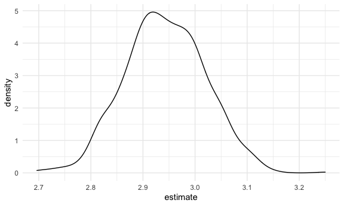

Bootstrapping
================

## Simulate data

``` r
n_samp = 250

sim_df_const = 
  tibble(
    x = rnorm(n_samp, 1, 1),
    error = rnorm(n_samp, 0, 1),
    y = 2 + 3 * x + error
  )

sim_df_nonconst = sim_df_const %>% 
  mutate(
  error = error * .75 * x,
  y = 2 + 3 * x + error
)
```

Plot the datasets

``` r
sim_df = 
  bind_rows(const = sim_df_const, nonconst = sim_df_nonconst, .id = "data_source") 

sim_df %>% 
  ggplot(aes(x = x, y = y)) + 
  geom_point(alpha = .5) +
  stat_smooth(method = "lm") +
  facet_grid(~data_source) 
```

    ## `geom_smooth()` using formula 'y ~ x'


``` r
lm(y ~ x, data = sim_df_const) %>% 
  broom::tidy() %>% 
  knitr::kable(digits = 3)
```

| term        | estimate | std.error | statistic | p.value |
| :---------- | -------: | --------: | --------: | ------: |
| (Intercept) |    2.065 |     0.086 |    23.998 |       0 |
| x           |    2.991 |     0.061 |    49.302 |       0 |

``` r
lm(y ~ x, data = sim_df_nonconst) %>% 
  broom::tidy() %>% 
  knitr::kable(digits = 3) ## lm gives results given assumptions are true, 但sim_df_nonconst并不是normal distribution， 所以即便是standard error很小，结果也是不准确的，解决这个问题的办法就是用bootstrap
```

| term        | estimate | std.error | statistic | p.value |
| :---------- | -------: | --------: | --------: | ------: |
| (Intercept) |    2.013 |     0.088 |    22.758 |       0 |
| x           |    3.023 |     0.062 |    48.476 |       0 |

## draw one bootstrap sample

one bootstrap 相当于取跟raw data相同sample size的samples，
但是每次只取一个，每次都放回，所以有些sample会被反复取
create bootstrap function

``` r
boot_sample = function(df) {
  sample_frac(df, replace = TRUE)
} 

# replace = TRUE,makes sample size fixed, 每次取必放回
```

check if this works…

``` r
boot_sample(sim_df_nonconst) %>% 
  ggplot(aes(x = x, y = y)) + 
  geom_point(alpha = .5) +
  stat_smooth(method = "lm")
```

    ## `geom_smooth()` using formula 'y ~ x'


## Many samples and analysis

``` r
boot_straps = 
  data_frame(
    strap_number = 1:1000,
    strap_sample = rerun(1000, boot_sample(sim_df_nonconst))
  )
```

    ## Warning: `data_frame()` is deprecated as of tibble 1.1.0.
    ## Please use `tibble()` instead.
    ## This warning is displayed once every 8 hours.
    ## Call `lifecycle::last_warnings()` to see where this warning was generated.

``` r
boot_straps ###相当于做1000次bootstrap，每次都取跟raw data samples size一致的sample数量
```

    ## # A tibble: 1,000 x 2
    ##    strap_number strap_sample      
    ##           <int> <list>            
    ##  1            1 <tibble [250 × 3]>
    ##  2            2 <tibble [250 × 3]>
    ##  3            3 <tibble [250 × 3]>
    ##  4            4 <tibble [250 × 3]>
    ##  5            5 <tibble [250 × 3]>
    ##  6            6 <tibble [250 × 3]>
    ##  7            7 <tibble [250 × 3]>
    ##  8            8 <tibble [250 × 3]>
    ##  9            9 <tibble [250 × 3]>
    ## 10           10 <tibble [250 × 3]>
    ## # … with 990 more rows

``` r
boot_straps %>% pull(strap_sample) %>% .[[1]]
```

    ## # A tibble: 250 x 3
    ##         x    error     y
    ##     <dbl>    <dbl> <dbl>
    ##  1  1.94  -0.716    7.10
    ##  2 -1.13  -0.0438  -1.43
    ##  3  1.38   0.00406  6.15
    ##  4  0.337 -0.391    2.62
    ##  5  0.815  0.480    4.92
    ##  6  0.982  0.487    5.43
    ##  7  0.406 -0.479    2.74
    ##  8  1.07  -0.781    4.43
    ##  9  0.156 -0.00644  2.46
    ## 10  2.40   1.71    10.9 
    ## # … with 240 more rows

``` r
boot_straps %>% 
  filter(strap_number %in% 1:2) %>% 
  mutate(strap_sample = map(strap_sample, ~arrange(.x, x))) %>% 
  pull(strap_sample)
```

    ## [[1]]
    ## # A tibble: 250 x 3
    ##         x   error       y
    ##     <dbl>   <dbl>   <dbl>
    ##  1 -1.13  -0.0438 -1.43  
    ##  2 -1.01  -0.596  -1.64  
    ##  3 -1.01  -0.596  -1.64  
    ##  4 -0.806  0.754   0.336 
    ##  5 -0.806  0.754   0.336 
    ##  6 -0.806  0.754   0.336 
    ##  7 -0.625 -0.0889  0.0369
    ##  8 -0.556 -0.614  -0.282 
    ##  9 -0.488 -0.402   0.134 
    ## 10 -0.483  0.764   1.31  
    ## # … with 240 more rows
    ## 
    ## [[2]]
    ## # A tibble: 250 x 3
    ##         x   error       y
    ##     <dbl>   <dbl>   <dbl>
    ##  1 -1.13  -0.0438 -1.43  
    ##  2 -1.01  -0.596  -1.64  
    ##  3 -1.01  -0.596  -1.64  
    ##  4 -1.01  -0.596  -1.64  
    ##  5 -0.806  0.754   0.336 
    ##  6 -0.806  0.754   0.336 
    ##  7 -0.806  0.754   0.336 
    ##  8 -0.732 -0.193  -0.389 
    ##  9 -0.732 -0.193  -0.389 
    ## 10 -0.625 -0.0889  0.0369
    ## # … with 240 more rows

``` r
boot_straps %>% 
  filter(strap_number %in% 1:3) %>% 
  unnest(strap_sample) %>% 
  ggplot(aes(x = x, y = y)) + 
  geom_point(alpha = .5) +
  stat_smooth(method = "lm", se = FALSE) +
  facet_grid(~strap_number) 
```

    ## `geom_smooth()` using formula 'y ~ x'


Can I run my analysis on these.. ? yes

``` r
boot_results = 
  boot_straps %>% 
  mutate(
    models = map(.x = strap_sample, ~lm(y ~ x, data = .x)),
    results = map(models, broom::tidy)
  ) %>% 
  select(strap_number, results) %>% 
  unnest(results)
  
boot_results
```

    ## # A tibble: 2,000 x 6
    ##    strap_number term        estimate std.error statistic   p.value
    ##           <int> <chr>          <dbl>     <dbl>     <dbl>     <dbl>
    ##  1            1 (Intercept)     2.06    0.0782      26.3 1.15e- 73
    ##  2            1 x               2.96    0.0540      54.7 1.75e-140
    ##  3            2 (Intercept)     2.00    0.0852      23.5 5.12e- 65
    ##  4            2 x               3.12    0.0579      53.9 6.85e-139
    ##  5            3 (Intercept)     1.97    0.0809      24.3 1.45e- 67
    ##  6            3 x               3.08    0.0576      53.4 5.22e-138
    ##  7            4 (Intercept)     2.07    0.112       18.5 1.96e- 48
    ##  8            4 x               2.91    0.0761      38.2 7.27e-106
    ##  9            5 (Intercept)     2.08    0.0841      24.7 7.87e- 69
    ## 10            5 x               2.98    0.0580      51.4 3.42e-134
    ## # … with 1,990 more rows

What do we have now?

``` r
boot_results %>% 
  group_by(term) %>% 
  summarize(
    mean_est = mean(estimate),
    boot_se = sd(estimate)) %>% 
  knitr::kable(digits = 3)
```

    ## `summarise()` ungrouping output (override with `.groups` argument)

| term        | mean\_est | boot\_se |
| :---------- | --------: | -------: |
| (Intercept) |     2.013 |    0.062 |
| x           |     3.017 |    0.096 |

``` r
## bootstrap help us get the actual standard error under repeated sampling not assuming constant variance
```

Look at the distribution

``` r
boot_results %>% 
  filter(term == "x") %>% 
  ggplot(aes(x = estimate)) +
  geom_density()
```



construct bootstrap CI

``` r
boot_results %>% 
  group_by(term) %>% 
  summarize(
    ci_lower = quantile(estimate, 0.025), 
    ci_upper = quantile(estimate, 0.975))
```

    ## `summarise()` ungrouping output (override with `.groups` argument)

    ## # A tibble: 2 x 3
    ##   term        ci_lower ci_upper
    ##   <chr>          <dbl>    <dbl>
    ## 1 (Intercept)     1.89     2.14
    ## 2 x               2.83     3.21

``` r
boot_straps %>% 
  unnest(strap_sample) %>% 
  ggplot(aes(x = x, y = y)) + 
  geom_line(aes(group = strap_number), stat = "smooth", method = "lm", se = FALSE, alpha = .1, color = "blue") +
  geom_point(data = sim_df_nonconst, alpha = .5)
```

    ## `geom_smooth()` using formula 'y ~ x'


## Boot strap using modelr

can we simplify anything…? yes

``` r
sim_df_nonconst %>% 
  bootstraps(1000) %>% 
  mutate(
    models = map(.x = splits, ~lm(y ~ x, data = .x)),
    results = map(models, broom::tidy)
  ) %>% 
  select(id, results) %>% 
  unnest(results) %>% 
  group_by(term) %>% 
  summarize(
    mean_est = mean(estimate),
    boot_se = sd(estimate)) %>% 
  knitr::kable(digits = 3)
```

    ## `summarise()` ungrouping output (override with `.groups` argument)

| term        | mean\_est | boot\_se |
| :---------- | --------: | -------: |
| (Intercept) |     2.013 |    0.062 |
| x           |     3.024 |    0.096 |
