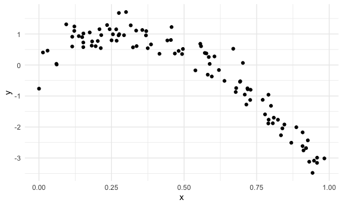
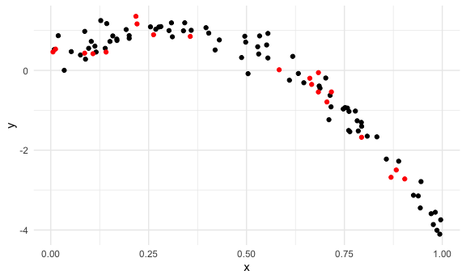
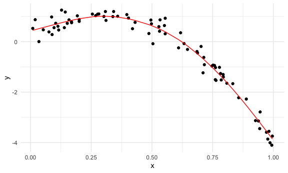
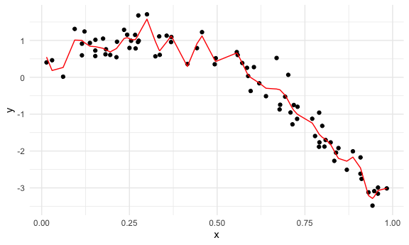
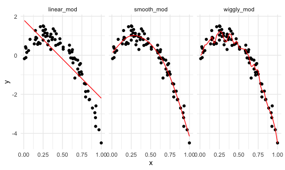
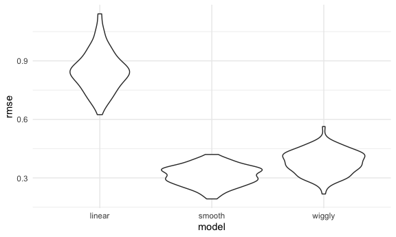

Cross validation
================

## simulate data

``` r
nonlin_df = 
  tibble(
    id = 1:100,
    x = runif(100, 0, 1),
    y = 1 - 10 * (x - .3) ^ 2 + rnorm(100, 0, .3)
  )
```

look at the data

``` r
nonlin_df %>% 
  ggplot(aes(x = x, y = y)) + 
  geom_point()
```



## Cross validation – by hand

get training and testing datasets

``` r
train_df = sample_n(nonlin_df, size = 80)
test_df = anti_join(nonlin_df, train_df, by = "id")


ggplot(train_df, aes(x = x, y = y)) + 
  geom_point() + 
  geom_point(data = test_df, color = "red")
```



Fit three models

``` r
linear_mod = lm(y ~ x, data = train_df)
smooth_mod = mgcv::gam(y ~ s(x), data = train_df)
wiggly_mod = mgcv::gam(y ~ s(x, k = 30), sp = 10e-6, data = train_df) # not smooth line
```

can I see what I just did

``` r
train_df %>% 
  add_predictions(smooth_mod) %>% 
  ggplot(aes(x = x, y = y)) + 
  geom_point() + 
  geom_line(aes(y = pred), color = "red")
```



``` r
train_df %>% 
  add_predictions(wiggly_mod) %>% 
  ggplot(aes(x = x, y = y)) + geom_point() + 
  geom_line(aes(y = pred), color = "red")
```



``` r
# see multiple prediction models in separate plots
train_df %>% 
  gather_predictions(linear_mod, smooth_mod, wiggly_mod) %>% 
  mutate(model = fct_inorder(model)) %>% 
  ggplot(aes(x = x, y = y)) + 
  geom_point() + 
  geom_line(aes(y = pred), color = "red") + 
  facet_wrap(~model)
```



look at the prediction accuracy

``` r
# compute root mean squared errors (RMSEs) for each model
rmse(linear_mod, test_df)    
```

    ## [1] 0.9571884

``` r
rmse(smooth_mod, test_df) # rmse smallest, smooth model is best in this case
```

    ## [1] 0.3513413

``` r
rmse(wiggly_mod, test_df)
```

    ## [1] 0.4220002

## Cross validation using `modelr` package

``` r
cv_df = 
  crossv_mc(nonlin_df, 100) # 100不是指raw data里有100个sample，而是100次resample
```

what is happening here

``` r
## 
cv_df %>% 
  pull(train) %>% .[[1]] %>% as_tibble()
```

    ## # A tibble: 79 x 3
    ##       id       x      y
    ##    <int>   <dbl>  <dbl>
    ##  1     1 0.167    0.878
    ##  2     2 0.653   -0.138
    ##  3     4 0.970   -3.82 
    ##  4     5 0.262    1.49 
    ##  5     6 0.732   -0.424
    ##  6     8 0.0390   0.145
    ##  7     9 0.250    0.776
    ##  8    10 0.151    1.27 
    ##  9    12 0.704   -0.954
    ## 10    13 0.00854 -0.173
    ## # … with 69 more rows

``` r
cv_df %>% 
  pull(test) %>% .[[1]] %>% as_tibble()
```

    ## # A tibble: 21 x 3
    ##       id      x      y
    ##    <int>  <dbl>  <dbl>
    ##  1     3 0.628   0.285
    ##  2     7 0.211   0.601
    ##  3    11 0.156   0.919
    ##  4    16 0.0811  0.816
    ##  5    19 0.719  -0.484
    ##  6    21 0.428   1.28 
    ##  7    23 0.454   0.679
    ##  8    30 0.454   0.587
    ##  9    36 0.592   0.121
    ## 10    42 0.249   1.27 
    ## # … with 11 more rows

``` r
#上面这俩合起来是一个完整的nonlin_df
#cv_df 里面有许多个这些的组合 
```

change resample structure to tibble

``` r
cv_df =
  cv_df %>% 
  mutate(
    train = map(train, as_tibble),
    test = map(test, as_tibble))
```

Let’s try to fit models and get RMSEs for them

``` r
cv_df = 
  cv_df %>% 
  mutate(
    linear_mod  = map(.x = train, ~lm(y ~ x, data = .x)),
    smooth_mod  = map(.x = train, ~gam(y ~ s(x), data = .x)),
    wiggly_mod  = map(.x = train, ~gam(y ~ s(x, k = 30), sp = 10e-6, data = .x))) %>% 
  mutate(
    rmse_linear = map2_dbl(.x = linear_mod, .y = test, ~rmse(model = .x, data = .y)),
    rmse_smooth = map2_dbl(.x = smooth_mod, .y = test, ~rmse(model = .x, data = .y)),
    rmse_wiggly = map2_dbl(.x = wiggly_mod, .y = test, ~rmse(model = .x, data = .y)))
```

what do these results say about the model choices?

``` r
cv_df %>% 
  select(starts_with("rmse")) %>% 
  pivot_longer(
    everything(),
    names_to = "model", 
    values_to = "rmse",
    names_prefix = "rmse_") %>% 
  mutate(model = fct_inorder(model)) %>% 
  ggplot(aes(x = model, y = rmse)) + geom_violin()
```



compute averages…

``` r
cv_df %>% 
  select(starts_with("rmse")) %>% 
  pivot_longer(
    everything(),
    names_to = "model", 
    values_to = "rmse",
    names_prefix = "rmse_") %>% 
  group_by(model) %>% 
  summarize(avg_rmse = mean(rmse))
```

    ## `summarise()` ungrouping output (override with `.groups` argument)

    ## # A tibble: 3 x 2
    ##   model  avg_rmse
    ##   <chr>     <dbl>
    ## 1 linear    0.849
    ## 2 smooth    0.313
    ## 3 wiggly    0.381
