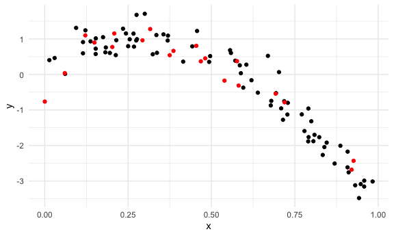
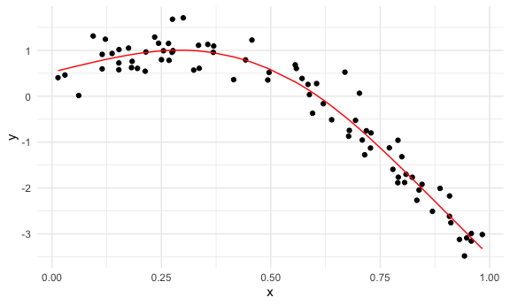
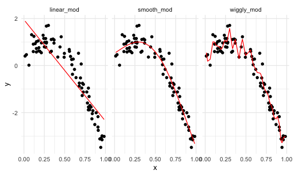

Cross validation
================

## simulate data

``` r
nonlin_df = 
  tibble(
    id = 1:100,
    x = runif(100, 0, 1),
    y = 1 - 10 * (x - .3) ^ 2 + rnorm(100, 0, .3)
  )
```

look at the data

``` r
nonlin_df %>% 
  ggplot(aes(x = x, y = y)) + 
  geom_point()
```


## Cross validation – by hand

get training and testing datasets

``` r
train_df = sample_n(nonlin_df, size = 80)
test_df = anti_join(nonlin_df, train_df, by = "id")


ggplot(train_df, aes(x = x, y = y)) + 
  geom_point() + 
  geom_point(data = test_df, color = "red")
```



Fit three models

``` r
linear_mod = lm(y ~ x, data = train_df)
smooth_mod = mgcv::gam(y ~ s(x), data = train_df)
wiggly_mod = mgcv::gam(y ~ s(x, k = 30), sp = 10e-6, data = train_df) # not smooth line
```

can I see what I just did

``` r
train_df %>% 
  add_predictions(smooth_mod) %>% 
  ggplot(aes(x = x, y = y)) + 
  geom_point() + 
  geom_line(aes(y = pred), color = "red")
```



``` r
train_df %>% 
  add_predictions(wiggly_mod) %>% 
  ggplot(aes(x = x, y = y)) + geom_point() + 
  geom_line(aes(y = pred), color = "red")
```


``` r
# see multiple prediction models in separate plots
train_df %>% 
  gather_predictions(linear_mod, smooth_mod, wiggly_mod) %>% 
  mutate(model = fct_inorder(model)) %>% 
  ggplot(aes(x = x, y = y)) + 
  geom_point() + 
  geom_line(aes(y = pred), color = "red") + 
  facet_wrap(~model)
```



look at the prediction accuracy

``` r
# compute root mean squared errors (RMSEs) for each model
rmse(linear_mod, test_df)    
```

    ## [1] 0.7541128

``` r
rmse(smooth_mod, test_df) # rmse smallest, smooth model is best in this case
```

    ## [1] 0.2195866

``` r
rmse(wiggly_mod, test_df)
```

    ## [1] 0.2681854
