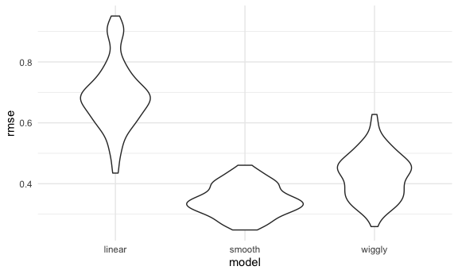

Cross validation
================

## simulate data

``` r
nonlin_df = 
  tibble(
    id = 1:100,
    x = runif(100, 0, 1),
    y = 1 - 10 * (x - .3) ^ 2 + rnorm(100, 0, .3)
  )
```

look at the data

``` r
nonlin_df %>% 
  ggplot(aes(x = x, y = y)) + 
  geom_point()
```


## Cross validation – by hand

get training and testing datasets

``` r
train_df = sample_n(nonlin_df, size = 80)
test_df = anti_join(nonlin_df, train_df, by = "id")


ggplot(train_df, aes(x = x, y = y)) + 
  geom_point() + 
  geom_point(data = test_df, color = "red")
```


Fit three models

``` r
linear_mod = lm(y ~ x, data = train_df)
smooth_mod = mgcv::gam(y ~ s(x), data = train_df)
wiggly_mod = mgcv::gam(y ~ s(x, k = 30), sp = 10e-6, data = train_df) # not smooth line
```

can I see what I just did

``` r
train_df %>% 
  add_predictions(smooth_mod) %>% 
  ggplot(aes(x = x, y = y)) + 
  geom_point() + 
  geom_line(aes(y = pred), color = "red")
```


``` r
train_df %>% 
  add_predictions(wiggly_mod) %>% 
  ggplot(aes(x = x, y = y)) + geom_point() + 
  geom_line(aes(y = pred), color = "red")
```


``` r
# see multiple prediction models in separate plots
train_df %>% 
  gather_predictions(linear_mod, smooth_mod, wiggly_mod) %>% 
  mutate(model = fct_inorder(model)) %>% 
  ggplot(aes(x = x, y = y)) + 
  geom_point() + 
  geom_line(aes(y = pred), color = "red") + 
  facet_wrap(~model)
```


look at the prediction accuracy

``` r
# compute root mean squared errors (RMSEs) for each model
rmse(linear_mod, test_df)    
```

    ## [1] 0.8455759

``` r
rmse(smooth_mod, test_df) # rmse smallest, smooth model is best in this case
```

    ## [1] 0.4122428

``` r
rmse(wiggly_mod, test_df)
```

    ## [1] 0.5343218

## Cross validation using `modelr` package

``` r
cv_df = 
  crossv_mc(nonlin_df, 100) # 100不是指raw data里有100个sample，而是100次resample
```

what is happening here

``` r
## 
cv_df %>% 
  pull(train) %>% .[[1]] %>% as_tibble()
```

    ## # A tibble: 79 x 3
    ##       id      x       y
    ##    <int>  <dbl>   <dbl>
    ##  1     1 0.213   0.545 
    ##  2     2 0.834  -2.27  
    ##  3     3 0.275   1.68  
    ##  4     4 0.718  -0.752 
    ##  5     5 0.457   1.22  
    ##  6     6 0.926  -2.43  
    ##  7     7 0.908  -2.62  
    ##  8     8 0.839  -2.04  
    ##  9     9 0.324   0.569 
    ## 10    10 0.0600  0.0377
    ## # … with 69 more rows

``` r
cv_df %>% 
  pull(test) %>% .[[1]] %>% as_tibble()
```

    ## # A tibble: 21 x 3
    ##       id        x      y
    ##    <int>    <dbl>  <dbl>
    ##  1    15 0.255     0.990
    ##  2    16 0.115     0.911
    ##  3    17 0.316     1.28 
    ##  4    20 0.0138    0.404
    ##  5    28 0.920    -2.68 
    ##  6    37 0.694    -0.526
    ##  7    40 0.369     0.955
    ##  8    43 0.709    -0.954
    ##  9    47 0.000184 -0.764
    ## 10    56 0.823    -1.77 
    ## # … with 11 more rows

``` r
#上面这俩合起来是一个完整的nonlin_df
#cv_df 里面有许多个这些的组合 
```

change resample structure to tibble

``` r
cv_df =
  cv_df %>% 
  mutate(
    train = map(train, as_tibble),
    test = map(test, as_tibble))
```

Let’s try to fit models and get RMSEs for them

``` r
cv_df = 
  cv_df %>% 
  mutate(
    linear_mod  = map(.x = train, ~lm(y ~ x, data = .x)),
    smooth_mod  = map(.x = train, ~gam(y ~ s(x), data = .x)),
    wiggly_mod  = map(.x = train, ~gam(y ~ s(x, k = 30), sp = 10e-6, data = .x))) %>% 
  mutate(
    rmse_linear = map2_dbl(.x = linear_mod, .y = test, ~rmse(model = .x, data = .y)),
    rmse_smooth = map2_dbl(.x = smooth_mod, .y = test, ~rmse(model = .x, data = .y)),
    rmse_wiggly = map2_dbl(.x = wiggly_mod, .y = test, ~rmse(model = .x, data = .y)))
```

what do these results say about the model choices?

``` r
cv_df %>% 
  select(starts_with("rmse")) %>% 
  pivot_longer(
    everything(),
    names_to = "model", 
    values_to = "rmse",
    names_prefix = "rmse_") %>% 
  mutate(model = fct_inorder(model)) %>% 
  ggplot(aes(x = model, y = rmse)) + geom_violin()
```



compute averages…

``` r
cv_df %>% 
  select(starts_with("rmse")) %>% 
  pivot_longer(
    everything(),
    names_to = "model", 
    values_to = "rmse",
    names_prefix = "rmse_") %>% 
  group_by(model) %>% 
  summarize(avg_rmse = mean(rmse))
```

    ## `summarise()` ungrouping output (override with `.groups` argument)

    ## # A tibble: 3 x 2
    ##   model  avg_rmse
    ##   <chr>     <dbl>
    ## 1 linear    0.688
    ## 2 smooth    0.346
    ## 3 wiggly    0.426

## Try on a real dataset

``` r
child_growth = read_csv("./data/nepalese_children.csv")
```

    ## Parsed with column specification:
    ## cols(
    ##   age = col_double(),
    ##   sex = col_double(),
    ##   weight = col_double(),
    ##   height = col_double(),
    ##   armc = col_double()
    ## )

weight vs arm circumference

``` r
child_growth %>% 
  ggplot(aes(x = weight, y = armc)) + 
  geom_point(alpha = .5)
```


``` r
child_growth =
  child_growth %>% 
  mutate(weight_cp = (weight > 7) * (weight - 7))  # change point to get a piecewise linear fit
```

Fit models I care about

``` r
linear_mod = lm(armc ~ weight, data = child_growth)
pwl_mod    = lm(armc ~ weight + weight_cp, data = child_growth) # piecewise linear fit
smooth_mod = gam(armc ~ s(weight), data = child_growth)
```

``` r
child_growth %>% 
  gather_predictions(linear_mod, pwl_mod, smooth_mod) %>% 
  mutate(model = fct_inorder(model)) %>% 
  ggplot(aes(x = weight, y = armc)) + 
  geom_point(alpha = .5) +
  geom_line(aes(y = pred), color = "red") + 
  facet_grid(~model)
```


try to do cross validation procedure try to understand model fit using
cv

``` r
cv_df =
  crossv_mc(child_growth, 100) %>% 
  mutate(
    train = map(train, as_tibble),
    test = map(test, as_tibble))
```

see if i can fit the models to the splits

``` r
cv_df = 
  cv_df %>% 
  mutate(
    linear_mod  = map(train, ~lm(armc ~ weight, data = .x)),
    pwl_mod     = map(train, ~lm(armc ~ weight + weight_cp, data = .x)),
    smooth_mod  = map(train, ~gam(armc ~ s(weight), data = as_tibble(.x)))) %>% 
  mutate(
    rmse_linear = map2_dbl(linear_mod, test, ~rmse(model = .x, data = .y)),
    rmse_pwl    = map2_dbl(pwl_mod, test, ~rmse(model = .x, data = .y)),
    rmse_smooth = map2_dbl(smooth_mod, test, ~rmse(model = .x, data = .y)))
```

``` r
cv_df %>% 
  select(starts_with("rmse")) %>% 
  pivot_longer(
    everything(),
    names_to = "model", 
    values_to = "rmse",
    names_prefix = "rmse_") %>% 
  mutate(model = fct_inorder(model)) %>% 
  ggplot(aes(x = model, y = rmse)) + geom_violin()
```


Among the non-linear models, the smooth fit from gam might be a bit
better than the piecewise linear model but jeff choice piecewise model
because it is easier to interprete
